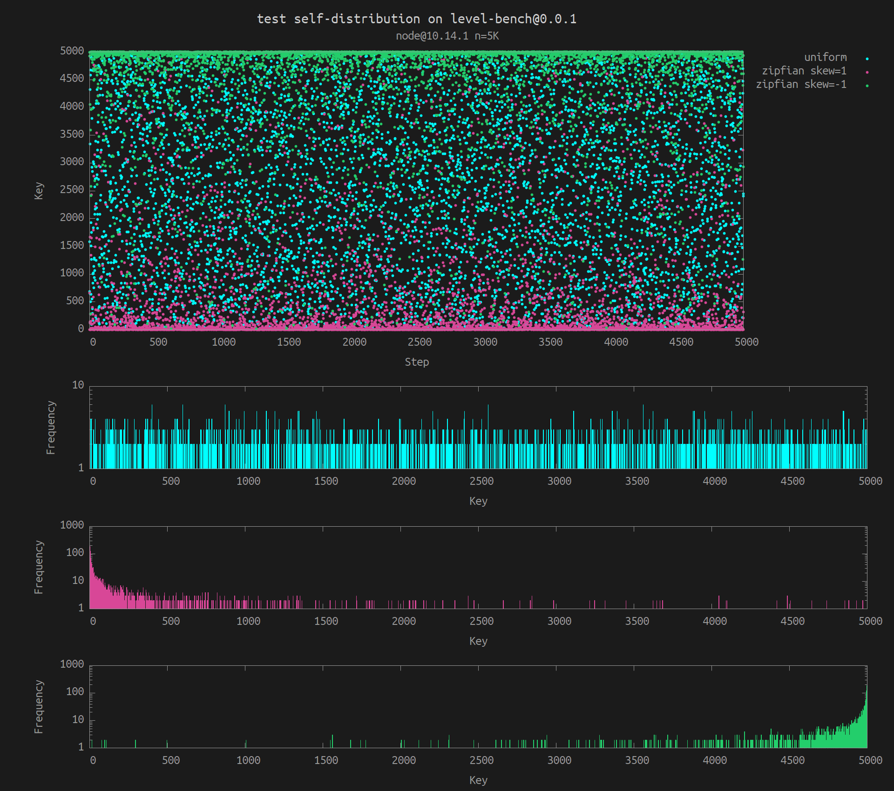

# keyspace

> **Get keys and values based on a probability distribution and seed.**  
> For deterministic input to benchmarks.

[](https://www.npmjs.org/package/keyspace)
[](https://www.npmjs.org/package/keyspace)
[](http://travis-ci.org/vweevers/keyspace)
[](https://standardjs.com)

## Usage

```js
const keyspace = require('keyspace')
const db = mydb()

// To prepare the database, we'll write 1M sequential
// keys, with random values of 100 bytes
const writer = keyspace(1e6, {
  keys: 'seq',
  values: 'random',
  valueSize: 100,

  // Always generate the same keys and values
  seed: 'a seed'
})

for (let i = 0; i < 1e6; i++) {
  db.put(writer.key(i), writer.value())
}

// Get a random key based on a Zipfian distribution
const reader = keyspace(1e6, {
  keys: 'random',
  distribution: 'zipfian',
  seed: 'a seed',

  // Favor latest keys
  skew: -1
})

db.get(reader.key())
db.get(reader.key())
```

## Visual Example



## API

_**Stability:** experimental. API may change or split up._

### `generator = keyspace(n, [options])`

Create a key and value generator for a keyspace of size N (aka cardinality). Uses xorshift128+ internally to be fast and random _enough_. Keys are encoded with `lexicographic-integer` to preserve order.

Options:

- `keys` (string): one of:
  - `random` (default): generate pseudo-random numeric keys with a certain probability `distribution`
  - `seq`: non-random, sequential numeric keys (0-N)
  - `seqReverse`: same keys but in reverse (N-0)
- `values` (string): one of:
  - `random` (default): generate pseudo-random values
  - `empty`: zero-length values or zero-filled if `valueSize` is set
- `seed` (string or Buffer): if not provided one will be generated.
- `distribution` (string): one of [`zipfian`](https://github.com/vweevers/zipfian-integer), `uniform` (default)
- `skew` (floating-point number): Zipfian skew (default 0)
- `offset` (number): offset keys (for example to simulate timestamps)
- `valueSize` (number): size of values in bytes
- `keyAsBuffer`, `valueAsBuffer`, `keyAsNumber` (boolean): if not set, keys and values are returned as strings (hex encoded).

### `key = generator.key([index])`

Get a key. The `index` argument is required for `seq` and `seqReverse`.

### `value = generator.value()`

Get a value.

## Install

With [npm](https://npmjs.org) do:

```
npm install keyspace
```

## License

[MIT](LICENSE.md) © 2019-present Vincent Weevers
